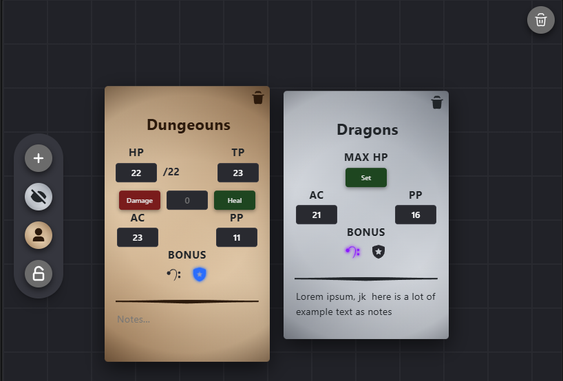

# initiative-tracker-dnd

Small web app for initiative and stats management during DnD combat, based on 2024 Player and Monster Hanbooks. It has local persistent storage.

For solution to work, **please** make sure you **have** the following **installed:**
1. [NodeJS](https://nodejs.org/en/download)
2. [MongoDB](https://www.mongodb.com/try/download/community)

# Features
1. Adding character cards that auto save + validate data is valid.
2. Cards can be dragged and dropped like sticky notes. (Thanks https://sticky-fcc.vercel.app/ for the tutorial!)
3. Automatic heal/damage that considers temporal HP as well.
4. If selected a card and then clicked on one of the color themes, role is updated (only cosmetic for now)
5. Lock/Unlock dragging of grid, also known as panning.
6. Notes expand to acommodate text, with a limit defined (turns into scroll)
7. Delete a character card or delete all.

# Setting up your environment
## Install packages in client folder
1. Go to src/client/initiative-tracker-app
2. Run `npm install`

## Install packages in server folder
1. Go to src/server
2. Run `npm install`

## Install packages in contracts folder
1. Go to src/contracts
2. Run `npm install`

## Create a .env file in the src/
PORT= 
MONGOOSE_DB_URL= 
VITE_API_REQUESTS_URL= 
VITE_API_CHAR_URL= 
VITE_API_COMBAT_HIGHLIGHTS_URL= 
VITE_API_BARDIC_INSPIRATION_URL= 
VITE_API_HEROIC_INSPIRATION_URL= 
VITE_API_NOTES_URL= 
VITE_API_MAX_HP_URL= 
VITE_API_CURR_HP_URL= 
VITE_API_MODIFY_HP_URL= 

# Running Solution
## OPTION 1 (RECOMMENDED): RunApps scripts
## For MacOs
1. Go to src/scripts
2. Run `chmod +x ./MacOS-RunApps.sh` to create executable. No need to rerun ever after success.
2. Run `./MacOS-RunApps.sh`

>[!WARNING]
> Processes are stopped but windows can't be closed unless you update your terminal settings to close shell when it exits. For more information on how look [here](https://support.apple.com/guide/terminal/change-profiles-shell-settings-trmlshll/2.15/mac/26). Otherwise, close manually.

## For Windows
1. Go to src/script 
2. Run `./Win-RunApps.ps1`

>[!WARNING]
> You might have to run a command to set the execution policy, basically allowing scripts that you downloaded to be run. Please look at [this](https://learn.microsoft.com/en-us/powershell/module/microsoft.powershell.security/set-executionpolicy?view=powershell-7.6#:~:text=Set%2DExecutionPolicy%20%2DExecutionPolicy%20RemoteSigned%20%2DScope%20LocalMachine) for documentation on how to do it.

## OPTION 2: Run everything separately
## Run the backend server
1. Go to src/server
2. Run `node index.js`
   
You should see the console logging the port in which the server is running, the address in which Mongo is connected, and that the app is succesfully running.
Any query to the database will be logged here.

## Run client
1. Go to src/client/initiative-tracker-app
2. Run `npm run dev`

> [!IMPORTANT]
> You should see the IP address to which the react app was launched. Copy the link and open it in your prefer browser. It should look something like http://localhost:port_number
